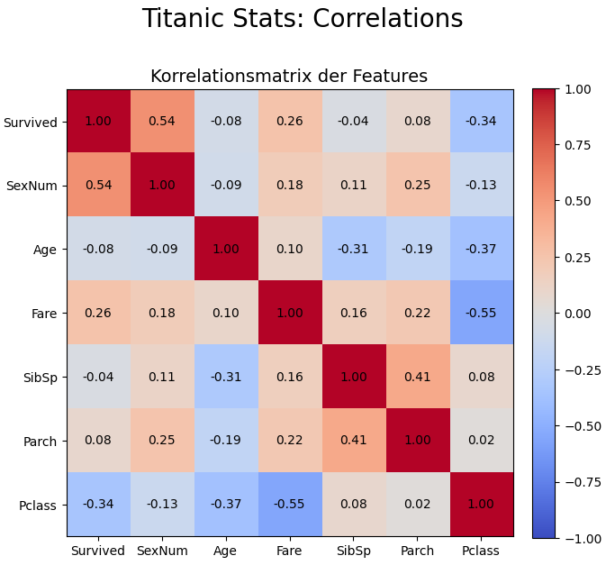
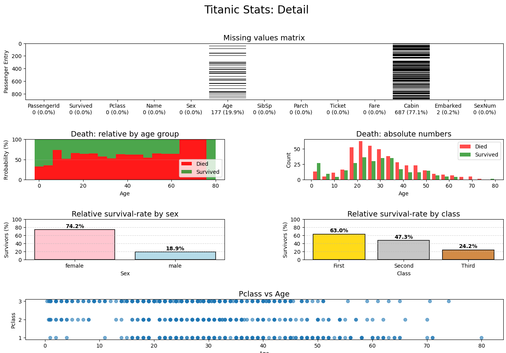

# Report and instructions

## Run & debug

Firstly navigate to [`../JonasBecker`](../).

Run everything: `python exercises_06.py`.\
Run plot (task 1): `python - exercises_06.plot`\
Run model (task 2): `python - exercises_06.model`

## Task 1 Report

The results of the individual test outputs (`python - exercises_06.plot`) comparing the features show both clear and less clear relationships.

### First, a correlation matrix of the features

This shows that many features are fairly independent of each other, while others are strongly correlated.

For example, `Fare` and `Pclass` have a negative relationship.  
High `Fare` for "low `Pclass`", since first class is the highest class for us humans.

The relationship between `Survived` and gender is also very strong.  
One gender seems much more likely to survive.  
In this example, `Sex-num` 1 (highest number = female) has the highest survival rate.

Features that appear independent include, for example, gender and age, with a correlation value very close to 0 at only -0.09.

### Now for a more detailed representation / investigation

Here, I have highlighted additional relationships, such as between `Pclass` and `Survived`, and arranged different visualizations in a grid-layout.

**Example:**\
first-class passengers seemed to have a certain advantage over lower classes during evacuation.

## Task 2

**Using Desicion Tree with Hyper-Parameter-Tuning:**\
Matthews Correlation Coefficient (MCC): 0.5809139245821947\
Accuracy: 0.7988826815642458
